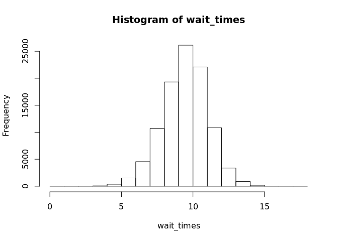

Quantile Regression Example
================
John Lashlee
2/24/2019

Purpose
-------

The purpose of this repo is to be an example of quantile regression for my colleague. It heavily lifts from the following two sources:

-   Ford, Clay. "University of Virginia Library Research Data Services Sciences." *Getting Started with Quantile Regression*, University of Virginia Library, 20 Sept. 2015, data.library.virginia.edu/getting-started-with-quantile-regression/.

-   Brendan-R. "Brendan-r/quantile\_regression." *Quantile Regression with R, JAGS and Stan*, GitHub, 15 Oct. 2015, github.com/brendan-r/quantile\_regression.

Design
------

Here's one thing everybody agrees on: trains are really great! It's just unanimous.

Say your boss is a Regional Manager of a bunch of train stations. You're the Assistant to the Regional Manager. Your trains mostly come on time, but as with anything in life, there is some variability. It really sucks when a train is late, so you want to reduce the train arrival **wait times**. You study your trains and propose an **improvement** that will make them arrive faster. Your **improvement** is targeted at reducing the *90th percentile* of the arrival **wait time**.

There are two **types** of trains in service, *new* trains and *old* trains.

The trains run on three train **platforms**, *main* platform, *south* platform, and *west* platform.

You implemented your improvement on some trains and held it back from others. Now all that's left to prove the value of your improvement is to

-   collect your train arrival **wait time** data measured in *minutes*,
-   noting
    -   the train **type**,
    -   **platform**,
    -   and whether or not it had the **improvement** active,
-   run and interpret the quantile regression.

Software
--------

Use the `quantreg` package for this simple example. It's written by the quantile regression [GOAT](https://www.urbandictionary.com/define.php?term=goat), Roger Koenker.

``` r
library(quantreg)
```

    ## Loading required package: SparseM

    ## 
    ## Attaching package: 'SparseM'

    ## The following object is masked from 'package:base':
    ## 
    ##     backsolve

Data
----

``` r
set.seed(20190224)
quantile <- .9
effects <- list(
  "type" = c("new" = -.7, "old" = -.06),
  "platform" = c("main" = .02, "south" = -.08, "west" = .01),
  "improvement" = c("TRUE" = -.3, "FALSE" = 0)
)
N <- 1e5
ind_vars <- data.frame(
  "type" = sample(names(effects$type), size = N, replace = TRUE, prob = c(.7, .3)),
  "platform" = sample(names(effects$platform), size = N, replace = TRUE, prob = c(.6, .3, .1)),
  "improvement" = sample(c("TRUE", "FALSE"), size = N, replace = TRUE, prob = c(.1, .9)),
  stringsAsFactors = FALSE
)
get_ind_var_effects <- function(var) effects[[var]][ind_vars[[var]]]
wait_times <- rnorm(n = N, 
                    mean = 10 + Reduce(`+`, Map(get_ind_var_effects, c("type", "platform", "improvement"))), 
                    sd = 1 + abs(get_ind_var_effects("type")))
```

Inspect the histogram of wait times:

``` r
hist(wait_times)
```



It looks reasonable enough.

### Fit

Now create the quantile regression to find the effect of your improvement on the 90th percentile wait time.

``` r
fit <- rq(wait_times ~ ind_vars$type + ind_vars$platform + ind_vars$improvement, 
          ci = TRUE, 
          tau = quantile)
```

    ## Warning in rq.fit.br(x, y, tau = tau, ...): Solution may be nonunique

Inspect the model output:

``` r
summary(fit)
```

    ## 
    ## Call: rq(formula = wait_times ~ ind_vars$type + ind_vars$platform + 
    ##     ind_vars$improvement, tau = quantile, ci = TRUE)
    ## 
    ## tau: [1] 0.9
    ## 
    ## Coefficients:
    ##                          Value     Std. Error t value   Pr(>|t|) 
    ## (Intercept)               11.50090   0.01245  923.48106   0.00000
    ## ind_vars$typeold          -0.19619   0.01544  -12.70591   0.00000
    ## ind_vars$platformsouth    -0.10159   0.01819   -5.58390   0.00000
    ## ind_vars$platformwest      0.00160   0.02483    0.06454   0.94854
    ## ind_vars$improvementTRUE  -0.22984   0.02747   -8.36583   0.00000

And inspect the output for the coefficients.

``` r
coef(fit)
```

    ##                          coefficients    lower bd    upper bd
    ## (Intercept)              11.500898600 11.48307866 11.52188686
    ## ind_vars$typeold         -0.196190693 -0.22103870 -0.17255049
    ## ind_vars$platformsouth   -0.101592401 -0.12902538 -0.06937077
    ## ind_vars$platformwest     0.001602333 -0.03436118  0.03767282
    ## ind_vars$improvementTRUE -0.229841984 -0.27101138 -0.17918899

Great, it looks like the improvement did in fact help reduce the 90th percentile wait time. Now you can confidently go back to your boss with your finding that you saved between 16.3 and 10.8 seconds of wait time on average. You're a hero.
